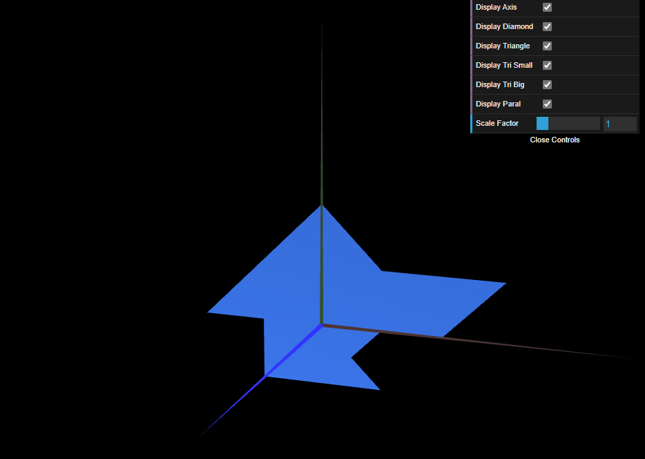

# CG 2024/2025

## Group T08G01
## TP 1 Notes

### **Ex 1**
We created 2 new figures: a triangle and a parallelogram.

For the MyTriangle we use only one triangle to compose the image, therefore we will use 3 vertices with the coordinates:
```
this.vertices = [
    -1, 1, 0,	//0
    -1, -1, 0,	//1
    1, -1, 0	//2
];

//Counter-clockwise reference of vertices
this.indices = [
    0, 1, 2
];
```

To display it in the scene, the checkboxes are added to the interface to display or hide each figure:
```
import { MyTriangle } from "./MyTriangle.js";
...

this.triangle = new MyTriangle(this);
...

this.displayTriangle = true;
...

if (this.displayTriangle) this.triangle.display();
...
```
> In MyScene.js

and
```
this.gui.add(this.scene, 'displayTriangle').name('Display Triangle');
```
> In MyInterface.js

The same goes for MyParallelogram, but it will  need 2 triangles to compose it (in the same way of the diamond), with the coordinates:
```
this.vertices = [
    0, 0, 0,	//0
    2, 0, 0,	//1
    1, 1, 0,	//2
    3, 1, 0		//3
];
```
For this to be visible in both sides, we will have to construct 2 more triangles with the coordinates in inverted order (clockwise):
```
//Counter-clockwise reference of vertices
this.indices = [
    0, 1, 2,
    2, 1, 3,
    2, 1, 0,
    3, 1, 2
];
```

### **Ex 2**
We created another 2 new figures: a small triangle and a big triangle. It follows the same structure as the MyTriangle constructed in exer. 1, with new coordinates given as:

```
this.vertices = [
    -1, 0, 0,	//0
    1, 0, 0,	//1
    0, 1, 0	    //2
];
```
> For the MyTriangleSmall

and

```
this.vertices = [
    -2, 0, 0,	//0
    2, 0, 0,	//1
    0, 2, 0	    //2
];
```
> For the MyTriangleBig

The Final Result with all the components displayed is:


