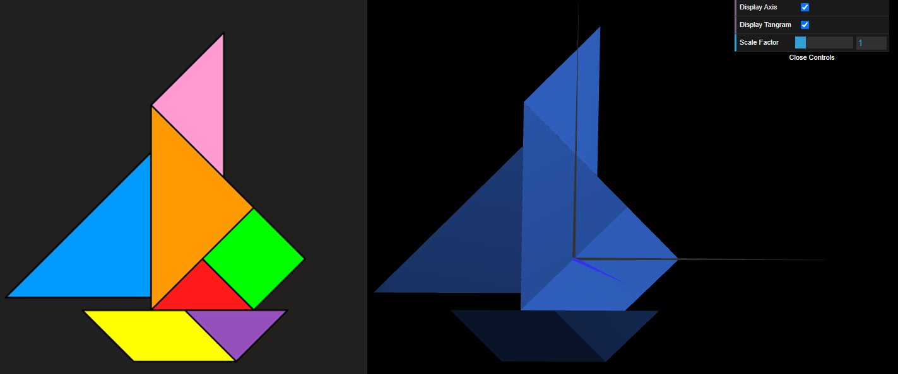
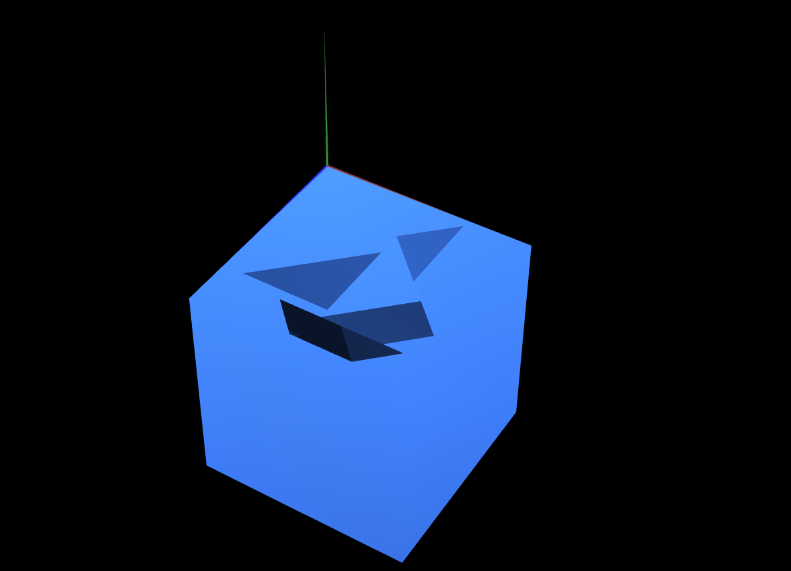
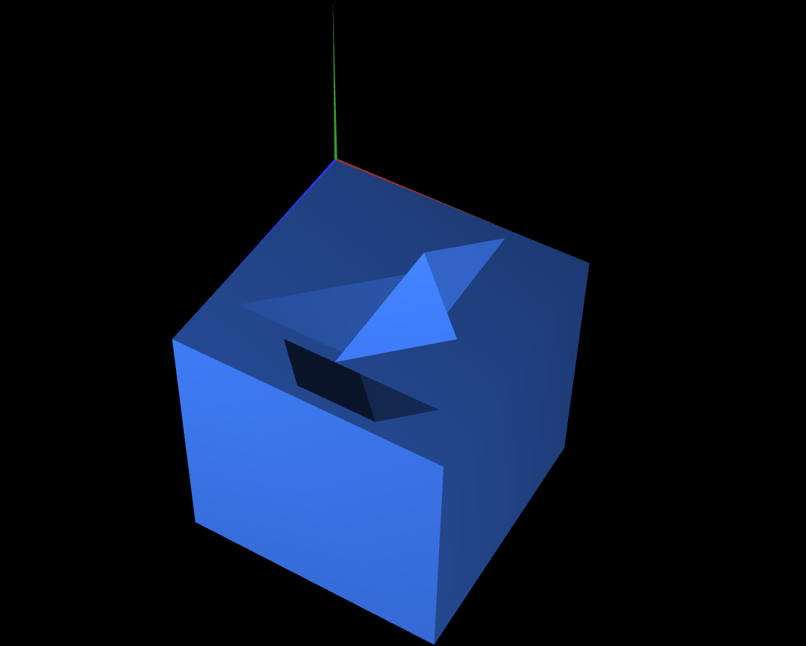

# CG 2024/2025

## Group T08G01
## TP 2 Notes

### **Ex 1**
- Use all of the pieces created in TP1 to build a Tangram figure.
- Each piece will suffer transformations to be placed accordingly to its relative position in the figure

```
Example of transformations:

this.scene.pushMatrix();
this.scene.translate(0.415,3,0);
this.scene.rotate(-Math.PI/4,0,0,1);
this.triangle.display();
this.scene.popMatrix();
```
Where:
- `this.scene.pushMatrix()` :: Saves current transformation matrix
to the stack
- `this.scene.popMatrix()` :: Sets the scene’s transformation matrix
to the previously saved matrix

> In `this.scene.rotate(angle,x,y,z)`, angles are defined in radians and (x,y,z) represents the rotation axis.

- With these steps done, we can move the code into a new class MyTangram, that is a collection of all figures.
- Adding a simple Checkbox allows us to hide or display the figure fully.



### **Ex 2**
- Created a new class `MyUnitCube` of dimensions 1x1x1.

> Using a similar strategy to the other figures, we can define a total of 12 triangles to create each of the 6 sides of the cube.
```
this.vertices = [
    //  x   y  z
    -0.5, 0.5, -0.5,  // 0 A
    -0.5, 0.5, 0.5,   // 1 B
    0.5, 0.5, 0.5,    // 2 C
    0.5, 0.5, -0.5,   // 3 D
    -0.5, -0.5, -0.5, // 4 E
    -0.5, -0.5, 0.5,  // 5 F
    0.5, -0.5, 0.5,   // 6 G
    0.5, -0.5, -0.5   // 7 H
];
```
> Rotations are done according to the side that is facing the outside of the cube. This guarantees that, from an outside perspective, the cube is visible, while from within it's not (which is irrelevant).
```
//Counter-clockwise reference of vertices
this.indices = [
    0,1,2, 0,2,3, // face 1
    0,4,5, 0,5,1, // face 2
    1,5,6, 1,6,2, // face 3
    2,6,7, 2,7,3, // face 4
    3,7,4, 3,4,0, // face 5
    5,4,7, 5,7,6  // face 6
];
```

With this done,
- We place it on the back of the Tangram figure (it will have a translation of 0.002 in Z to make it more vizible from the cube).
- And rotate this pair to be parallel to `XZ`, with vertex A of the cube placed in the origin (0,0,0) and scale of the cube was increased in 7 to fit the Tangram.



### **Ex 3**
- Created a new class `MyQuad` and `MyUnitCubeQuad` of dimensions 1x1x1.

> We first define the `MyQuad` which will be used to compose `MyUnitCubeQuad` using 2 triangles:.
```
this.vertices = [
    //  x   y  z
    -0.5, 0.5, 0,   //0 A
    -0.5, -0.5, 0,	//1 B
    0.5, -0.5, 0,	//2 C
    0.5, 0.5, 0		//3 D
];

//Counter-clockwise reference of vertices
this.indices = [
    0, 1, 2,
    0, 2, 3
];
```
> The placement of the 6 Quad will be done by keeping the visible side facing out, in the same strategy done in `MyTangram`. E.g. face 1:
```
this.scene.pushMatrix();
this.scene.translate(0,0,-0.5);
this.scene.rotate(-Math.PI,0,1,0);
this.l1.display();
this.scene.popMatrix();
```

With this done, we will replace the `MyUnitCube` by new `MyUnitcubeQuad` in the same position. The difference is that now, instead of managing the cube as a whole object, we compose it with 6 different instances (`MyQuad`), which create edges between them making the cube more visible. 

