# CG 2024/2025

## Group T08G01
## TP 3 Notes

### **Experiências**

- **Steps 1 and 2**:

In this experience, we create a slider to change the Ambient Light. 

We start by adding a default variable for the ambient light intensity inside the `initLights()` method from `MyScene.js`:
```
initLights() {
    this.ambientIntensity = 0.5; // set with a value of 0.5, for example
    
    this.setGlobalAmbientLight(this.ambientIntensity, this.ambientIntensity, this.ambientIntensity, 1.0);

    (...)
}
```
Then, we create a new function after `initLights()` to update the ambient light intensity whenever we call it:
```
updateAmbientLight(value) {
    this.ambientIntensity = value;
    this.setGlobalAmbientLight(value, value, value, 1.0);
}
```
Finally, by adding the following lines to `MyInterface.js` inside the `init(aplication)`:
```
this.gui.add(this.scene, 'ambientIntensity', 0.0, 1.0).name("Ambient Light").onChange((value) => {
    this.scene.updateAmbientLight(value);
});
```
Each time the value in the slider is changed, the Ambient Light Intesity does too.

- **Steps 3 to 5**:

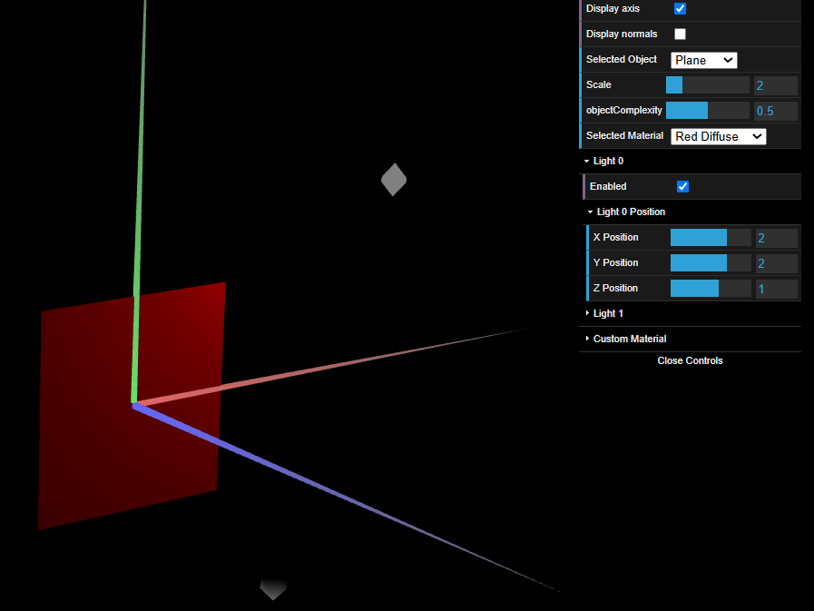

- **Step 6**, with "Especular" on the left and "Difusa" on the right:

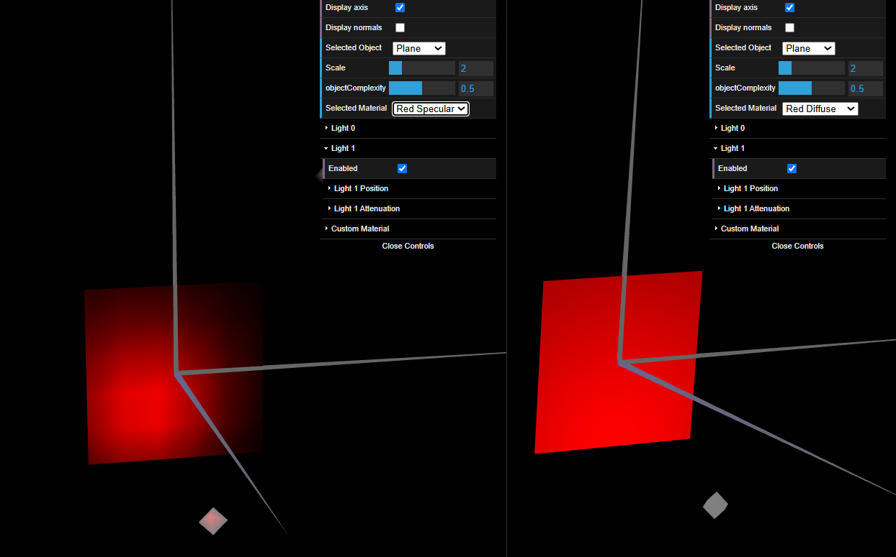

- **Step 7**: In the "Custom" as Selected Material, we can change the color of the light: 

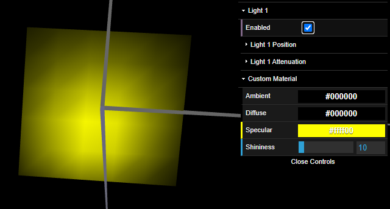

- **Steps 8 and 9**: Beside color, we can manipulate the "shininess" with the slider in "Custom Material" too. And also change the smoothness of the object by changing the `objectComplexity` slider.

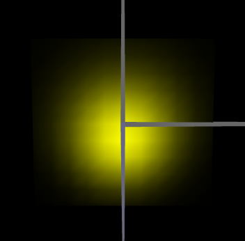

- **Steps 10 to 13**: With 2 types of lights displayed at the same time, Blue as ambient and Red as difuse, the lights get mixed resulting in a purple-ish color in the plane:

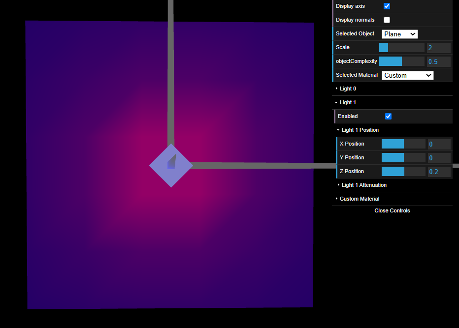

- **Steps 14 to 16**: Changing the Attenuation we checked out the influence of it in the scene combined with its distance with the light:

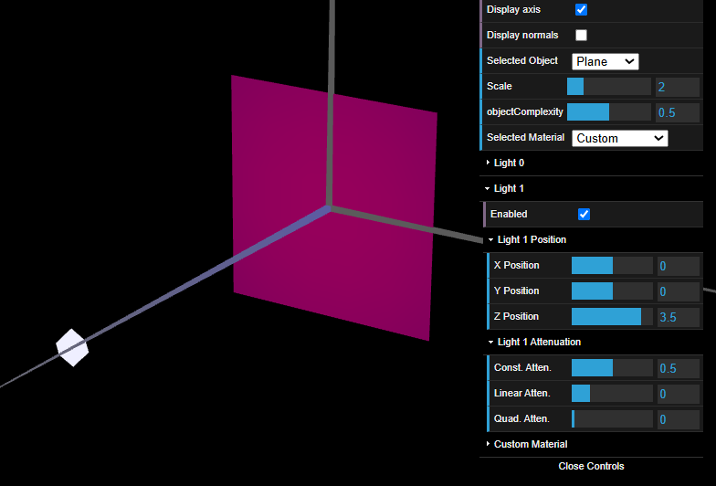

### **Ex 1**
- For the cube, we define 24 vertices instead of 8, such that we can have more than one normal vector for each corner of the cube.
- Each normal points outward perpendicular to its respective face.

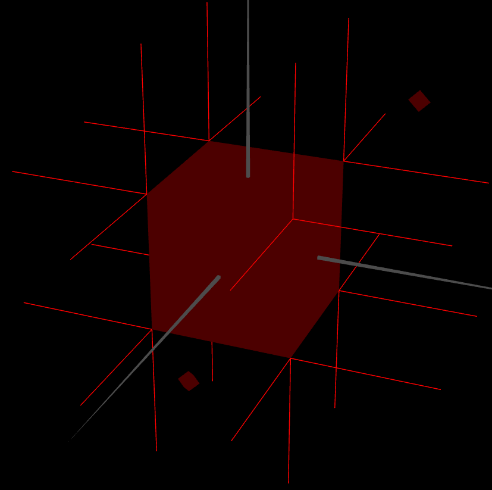

- For the tangram, we need to define each normal vector inside of each figure that composes the tangram. For example, `MyDiamond.js`:
```
initBuffers() {
		this.vertices = [
			//  x   y  z
  			-1, 0, 0,   // 0
			0, -1, 0,	// 1
			0, 1, 0,	// 2
			1, 0, 0		// 3
		];

		//Counter-clockwise reference of vertices
		this.indices = [
			0, 1, 2,
			1, 3, 2
		];

		// Normals (pointing outward along +Z)
		this.normals = [
			0, 0, 1,  // 0
			0, 0, 1,  // 1
			0, 0, 1,  // 2
			0, 0, 1   // 3
		];
	}
```
- Then, we can create a function inside `MyTangram.js`, that turns the normals of each figure on and off according to the "**Display normals**" checkbox:
```
    setNormalViz(display) {
        if (display) {
            this.d.enableNormalViz();
            this.t.enableNormalViz();
            this.s1.enableNormalViz();
            this.s2.enableNormalViz();
            this.b1.enableNormalViz();
            this.b2.enableNormalViz();
            this.p.enableNormalViz();
        } else {
            this.d.disableNormalViz();
            this.t.disableNormalViz();
            this.s1.disableNormalViz();
            this.s2.disableNormalViz();
            this.b1.disableNormalViz();
            this.b2.disableNormalViz();
            this.p.disableNormalViz();
        }
    }
```
- A similar function, with the same name as the previous, was added to every other object:
```
setNormalViz(displayNormals) {
    if (displayNormals) {
        this.enableNormalViz();
    } else {
        this.disableNormalViz();
    }
}
```
- So that our `MyScene.js` can look like this at the end, and achieve a faster and more efficient approach to turning normals on and off for every object at once (using a `for-loop`):
```
    // ---- BEGIN Primitive drawing section

    this.materials[this.selectedMaterial].apply();

    this.pushMatrix();
    this.scale(this.scaleFactor,this.scaleFactor,this.scaleFactor);
    
    for (let object of this.objects) {
        object.setNormalViz(this.displayNormals);
    }
    
    this.objects[this.selectedObject].display();
    this.popMatrix();
    // ---- END Primitive drawing section
```

***

With the normal vectors all done, we can move on to the next step, where we will create a new material to resemble a wooden texture.
- In the `initMaterials()` function from `MyScene.js`, we create a new material `material4`:
```
this.material4 = new CGFappearance(this);
this.material4.setAmbient(0.3, 0.2, 0.1, 1.0);  
this.material4.setDiffuse(0.7, 0.5, 0.3, 1.0);    
this.material4.setSpecular(0.1, 0.05, 0.03, 1.0); 
this.material4.setShininess(5.0); 
```
And add it to the materials list:
```
this.materials = [this.material1, this.material2, this.material3, this.material4, this.customMaterial];
this.materialIDs = {'Red Ambient': 0, 'Red Diffuse': 1, 'Red Specular': 2, 'Wooden Texture': 3, 'Custom': 4 };
```
- We can test this with the cube to see the result:

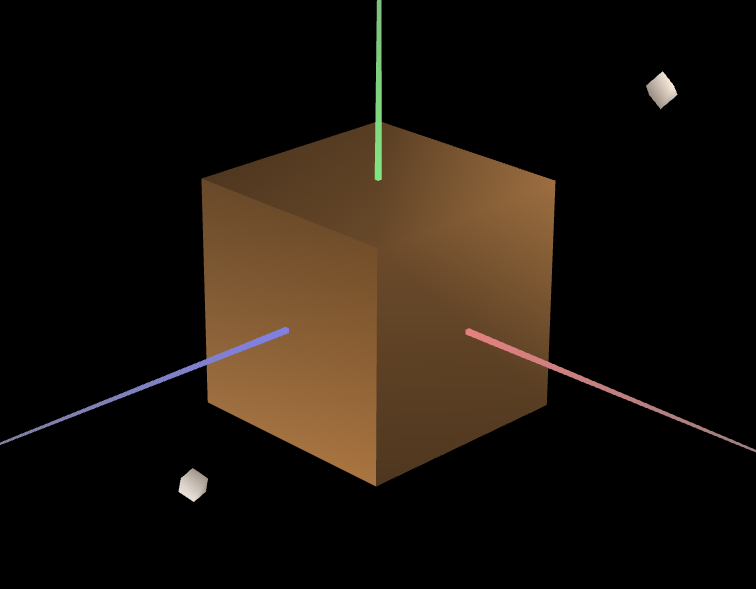

***

Next, we will apply materials to the tangram pieces. This can all be done inside `MyTangram.js`.
```
this.materials = {
    'diamond': new CGFappearance(this.scene),
    'triangle': new CGFappearance(this.scene),
    'smallTriangle1': new CGFappearance(this.scene),
    'smallTriangle2': new CGFappearance(this.scene),
    'bigTriangle1': new CGFappearance(this.scene),
    'bigTriangle2': new CGFappearance(this.scene),
    'parallelogram': new CGFappearance(this.scene)
};
```
- Since all pieces follow the same principle, below is the example for the `diamond`:
```
this.materials.diamond.setAmbient(0.5, 0.5, 0.5, 1.0);
this.materials.diamond.setDiffuse(0.0, 1.0, 0.0, 1.0); // Green
this.materials.diamond.setSpecular(1.0, 1.0, 1.0, 1.0);
this.materials.diamond.setShininess(50.0);  // High shininess

(...)

display() {
        // Apply materials and display Tangram
        this.scene.pushMatrix();
        this.materials.diamond.apply();
        this.scene.translate(1, 0, 0);
        this.d.display();
        this.scene.popMatrix();

(...)

} 
```
> The color of the object is declared in the `setDiffuse` and the application of the material **must** come before the `display()` call.

***

Lastly, we apply the custom material to the diamond, allowing for us to change its colors as we please.
```
MyTangram.js:

display() {
    // Apply materials and display Tangram
    this.scene.pushMatrix();
    this.scene.customMaterial.apply(); // the custom material is applied to the Diamond figure
    this.scene.translate(1, 0, 0);
    this.d.display();
    this.scene.popMatrix();

    (...)
}
```

With the lights off, we can see how this affected the Tangram only on the diamond:

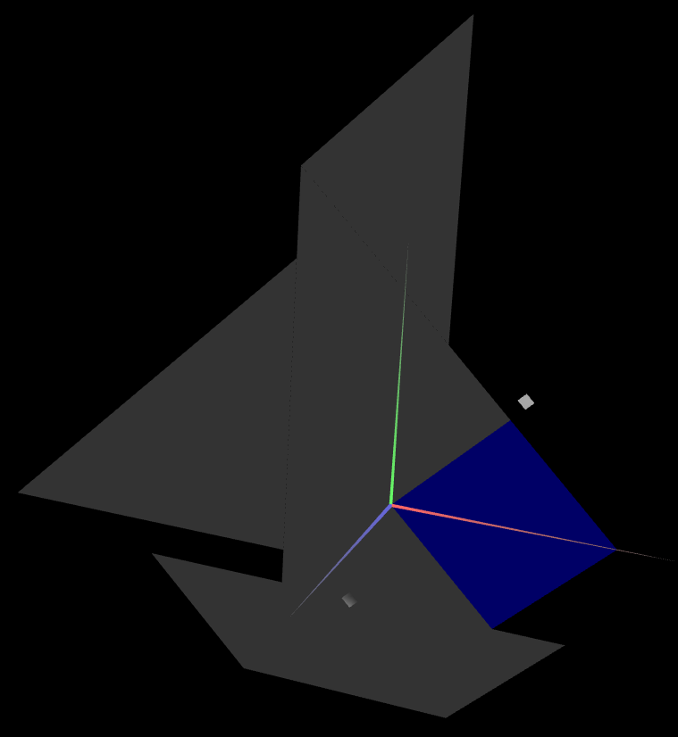

With Light 1 on, we get this result:

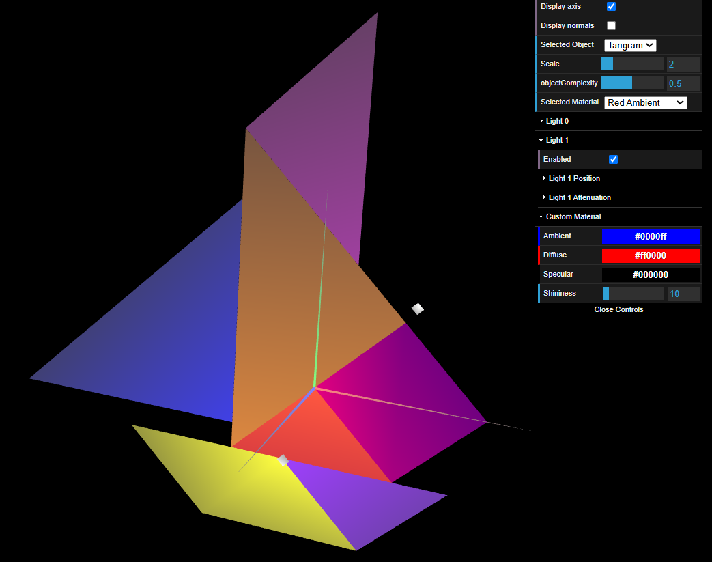

### **Ex 2**
- We create a new object `MyPrism.js`, that allows **X** slices and **Y** stacks on display, which are defined when called in `MyScene` in `new MyPrism(this, X, Y)`.
- We define the normals for each vertex following a "Constant Shading" approach, such that every normal is perpendicular to its vertex side, therefore there will be 2 normals (and so do the indices) in same vertex.
```
// for each slice we have 2 vertex
    var x1 = Math.cos(ang);
    var y1 = Math.sin(ang);

// where
    var ang = slice * alphaAng;

//and the same goes for the next slice
    var nextAng = (slice + 1) * alphaAng;
    var x2 = Math.cos(nextAng);
    var y2 = Math.sin(nextAng);

// And therefore we add those vertex in the list by push
    this.vertices.push(x1, y1, z);
    this.vertices.push(x2, y2, z);
```
And for the Normals we follow the same approach but with an ajust to the angle so it will be 90 degree with the respective slice
```
    let nx = Math.cos((slice + 0.5) * alphaAng);
    let ny = Math.sin((slice + 0.5) * alphaAng);
    this.normals.push(nx, ny, 0);
    this.normals.push(nx, ny, 0);
```

- We construct a new object with 8 slices and 20 stacks, **while maintaining the total height of the prism in value 1**.

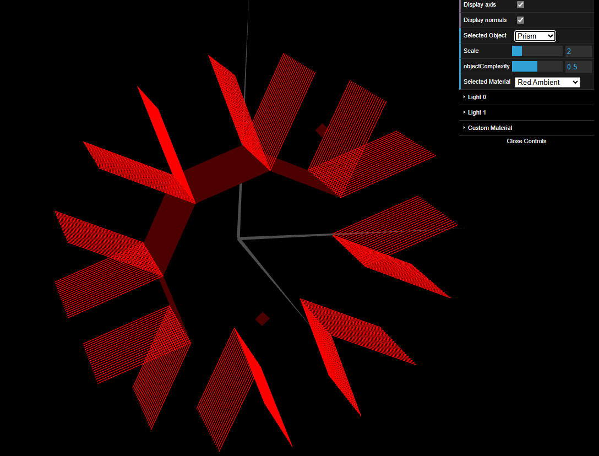

### **Ex 3**
- The construction is very same from the prism, but since we will be using an "Smooth shading" approach, instead of having 2 vertices we only need one, resulting in some adjusts:

```
    var ang = slice * alphaAng;
    var x = Math.cos(ang);
    var y = Math.sin(ang);
    this.vertices.push(x, y, z);
    this.normals.push(x, y, 0);
```
- Then we also construct it with 8 slices and 20 stacks, **while maintaining the total height of the prism in value 1**.

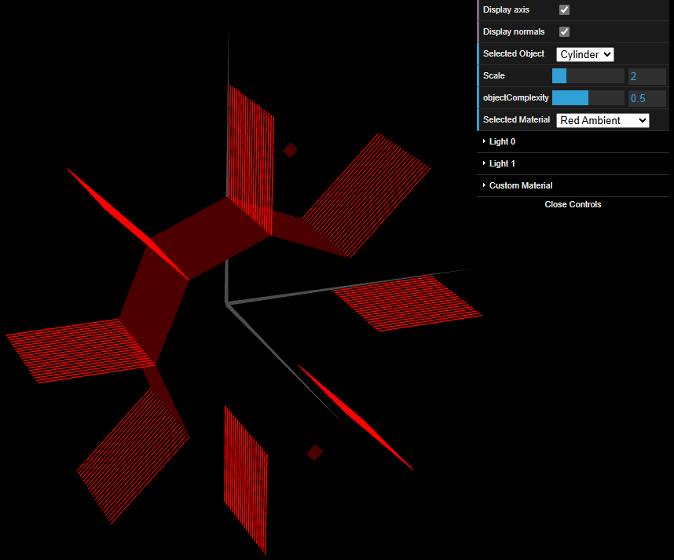

### Conclusion
After concluding the 3rd exercise we can compare the difference between cylinder and prism and how the nomal vectors affect on the object by using the Specular light: 

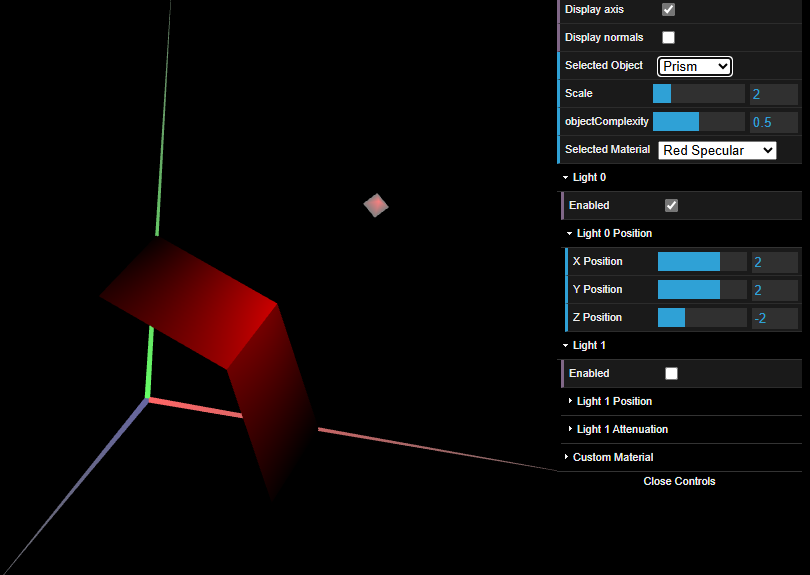

> In the prism we can cleary see the segmentation between the surfaces.

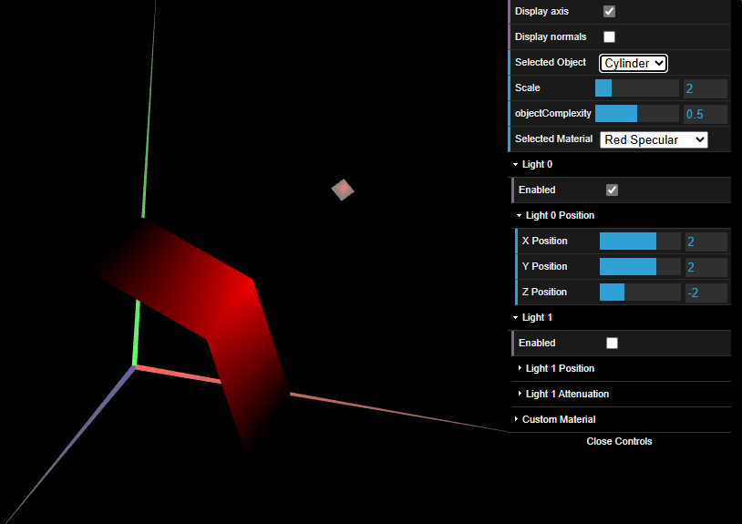

> Meanwhile in cylinder that segmentation is less noticeable and appearing to be more smooth.