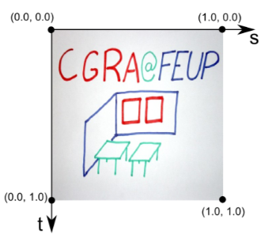
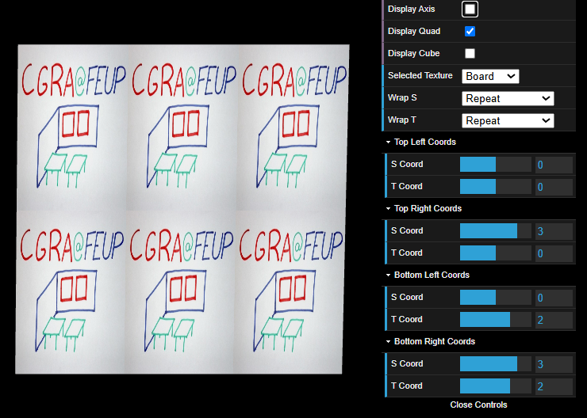
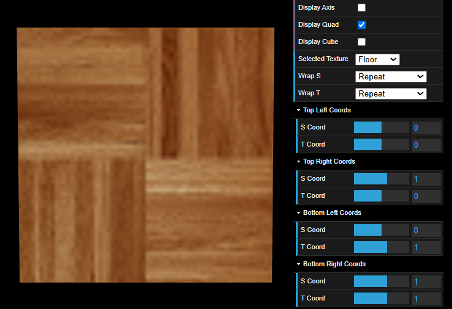
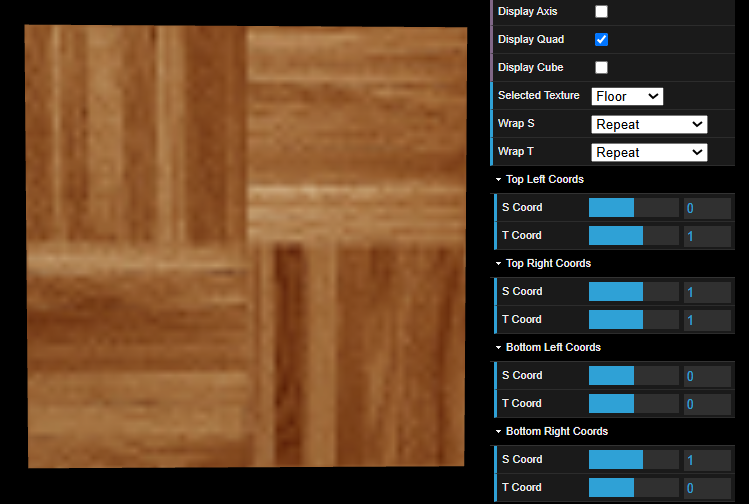
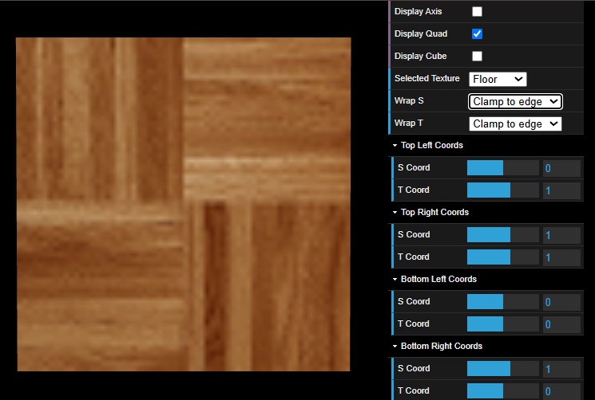
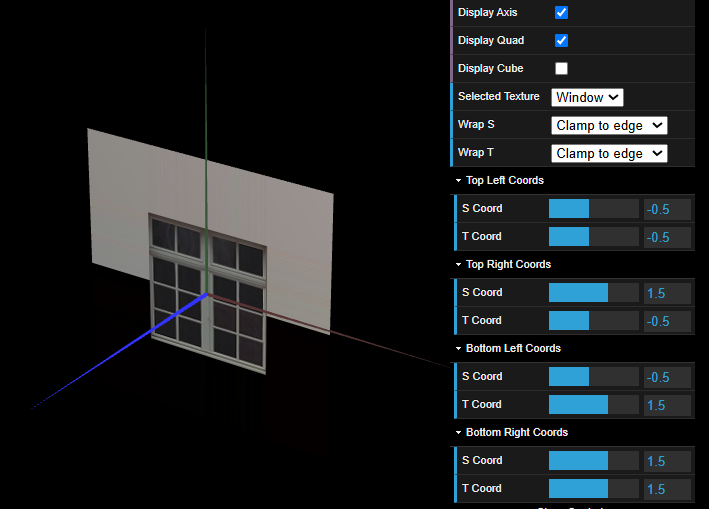
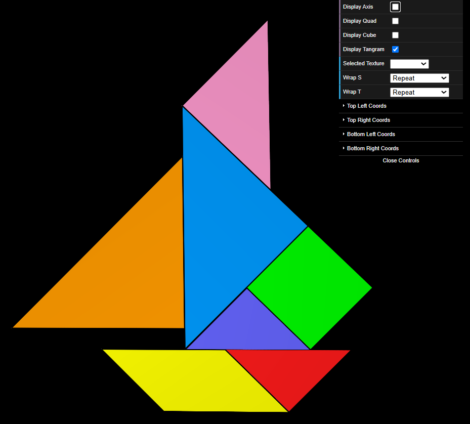
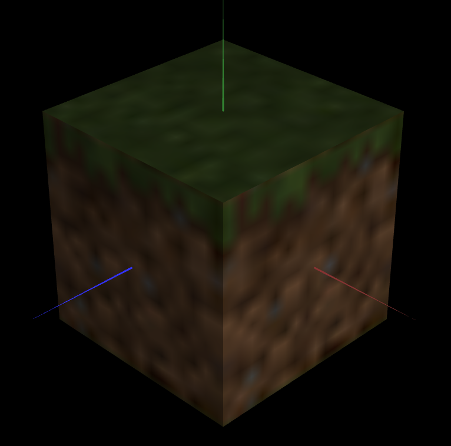
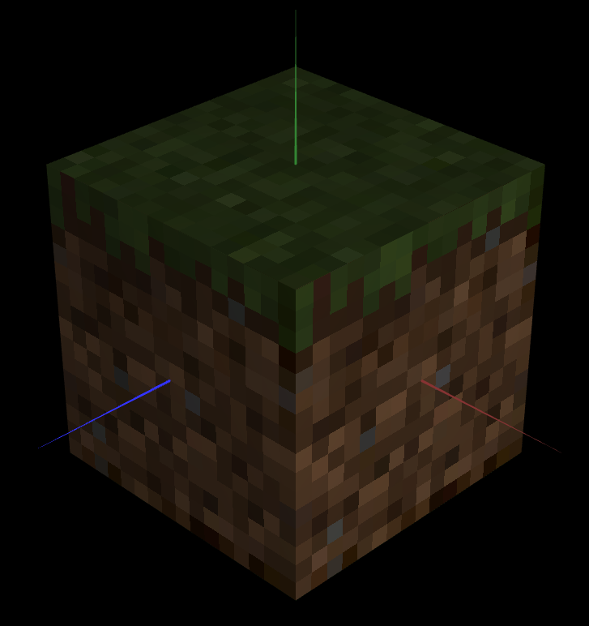

# CG 2024/2025

## Group T08G01
## TP 4 Notes

### **Experiments**


For these tasks, we will want to focus on how the mapping of a texture works through the use of coordinates.

To start off, let's take Experiment 1 as an example.

#### **Exp 1**
We are asked to repeat the `board` texture in three columns and two lines. To do this, we must manipulate the texture coordinates such that the **s** axis is divided into **three** parts and the **t** axis into **two**. For this, all non-zero values must change.
- (0,0) stays as (0,0)
- (1,0) becomes (3,0)
- (0,1) becomes (0,2)
- (1,1) becomes (3,2)



#### **Exp 2**
In this experiment we must invert the floor texture vertically. \
This is as simple as assuming these changes to the colors:
- Top Left -> Bottom Left
- Top Right -> Bottom Right
- Bottom Left -> Top Left
- Bottom Right -> Top Right

From this:



We get this:



#### **Exp 3**
Changing the texture wrap to `Clamp to Edge`, does not show any changes:



#### **Exp 4**
For the last experiment, we will select the `Window` texture and center it in the `MyQuad` figure:



### **Ex 1**
For this exercise, we will add the Tangram object and all of its pieces to the files, such that we can create a new material with an applied texture, to each of the pieces.


Given this image, we will want to map each piece to its dedicated color from the picture.

For each piece, we create an array for the texture coordinates. \
For example, `MyDiamond.js`:
```
this.vertices = [
			//  x   y  z
  			-1, 0, 0,   //0      
			0, -1, 0,	//1
			0, 1, 0,	//2
			1, 0, 0		//3
		];

(...)

this.texCoords = [
			0, 0.5,  // 0
			0.25, 0.75,  // 1
			0.25, 0.25,   // 2
			0.5, 0.5	// 3
		];
```

This will map each vertex of the figure to a point in the picture. \
Once we do this for every figure, we will want to create a material such that we can apply it when the tangram is displayed.

In `MyTangram.js`:
```
Add the new material to the list of materials:

this.materials = {
    'diamond': new CGFappearance(this.scene),
    'triangle': new CGFappearance(this.scene),
    'smallTriangle1': new CGFappearance(this.scene),
    'smallTriangle2': new CGFappearance(this.scene),
    'bigTriangle1': new CGFappearance(this.scene),
    'bigTriangle2': new CGFappearance(this.scene),
    'parallelogram': new CGFappearance(this.scene),
    'tangramMaterial': new CGFappearance(this.scene)
};

Define the properties of the material, giving it the texture from `tangram.png`:

this.materials.tangramMaterial.setAmbient(0.1, 0.1, 0.1, 1);
this.materials.tangramMaterial.setDiffuse(0.9, 0.9, 0.9, 1);
this.materials.tangramMaterial.setSpecular(0.1, 0.1, 0.1, 1);
this.materials.tangramMaterial.setShininess(50.0);
this.materials.tangramMaterial.loadTexture('images/tangram.png');
this.materials.tangramMaterial.setTextureWrap('REPEAT', 'REPEAT');

For each figure, apply this new textured material:

this.scene.pushMatrix();
this.materials.tangramMaterial.apply();
this.scene.translate(1, 0, 0);
this.diamond.display();
this.scene.popMatrix();
```

With all of these steps done, we get the following result:



### **Ex 2**
For this second exercise, we will apply textures to a cube composed of planes. The objective is to turn it in a minecraft grass block, such that the textures look like they are 16 x 16 pixels. This will also require `nearest filtering` when we apply the textures, so they don't have low quality.

We can start by adding `MyUnitCubeQuad.js` to the files and changing the constructor, to receive as extra parameters, six different textures:
```
constructor(scene, top, front, right, back, left, bottom) {
	super(scene);

	this.top = top instanceof CGFtexture ? top : new CGFtexture(scene, top);
	this.front = front instanceof CGFtexture ? front : new CGFtexture(scene, front);
	this.right = right instanceof CGFtexture ? right : new CGFtexture(scene, right);
	this.back = back instanceof CGFtexture ? back : new CGFtexture(scene, back);
	this.left = left instanceof CGFtexture ? left : new CGFtexture(scene, left);
	this.bottom = bottom instanceof CGFtexture ? bottom : new CGFtexture(scene, bottom);

	this.quads = {
		front: new MyQuad(scene),
		right: new MyQuad(scene),
		back: new MyQuad(scene),
		left: new MyQuad(scene),
		top: new MyQuad(scene),
		bottom: new MyQuad(scene),
	};
}
```
> The quads were also moved inside the constructor.

Then, in MyScene.js, we create a new instance for the cube, passing the minecraft block textures as parameters to the constructor:
- `this.cube = new MyUnitCubeQuad(this, 'images/mineTop.png', 'images/mineSide.png', 'images/mineSide.png', 'images/mineSide.png', 'images/mineSide.png', 'images/mineBottom.png');`

We will quickly notice the low quality in the textures:



This happens due to linear filtering being the default. We can easily fix this by adding a checkbox to our interface:
- `this.gui.add(this.scene, 'useNearestFiltering').name('Use Nearest Filtering');`

That will allow us to toggle between **linear** and **nearest** filtering.

Then, we prepare this filter in the `display()` from `MyScene.js`:
```
display() {
  (...)
	this.setDefaultAppearance();
	this.scale(this.scaleFactor, this.scaleFactor, this.scaleFactor);

	if (this.useNearestFiltering) {
		this.gl.texParameteri(this.gl.TEXTURE_2D, this.gl.TEXTURE_MAG_FILTER, this.gl.NEAREST);
		this.gl.texParameteri(this.gl.TEXTURE_2D, this.gl.TEXTURE_MIN_FILTER, this.gl.NEAREST);
	} else {
		this.gl.texParameteri(this.gl.TEXTURE_2D, this.gl.TEXTURE_MAG_FILTER, this.gl.LINEAR);
		this.gl.texParameteri(this.gl.TEXTURE_2D, this.gl.TEXTURE_MIN_FILTER, this.gl.LINEAR);
	}

	// ---- BEGIN Primitive drawing section

	this.quadMaterial.apply();

	if (this.displayQuad) this.quad.display();
	if (this.displayCube) this.cube.display();
	if (this.displayTangram){ this.tangram.display();
	}

	// ---- END Primitive drawing section
}
```

And to every side of the cube in `MyUnitCubeQuad.js`:
```
display(){
	const gl = this.scene.gl;
	const filter = this.scene.useNearestFiltering ? gl.NEAREST : gl.LINEAR;

	// Front Face (+Z)
	if (this.front){
		this.front.bind();
		gl.texParameteri(gl.TEXTURE_2D, gl.TEXTURE_MAG_FILTER, filter);
		gl.texParameteri(gl.TEXTURE_2D, gl.TEXTURE_MIN_FILTER, filter);
	}
	this.scene.pushMatrix();
	this.scene.translate(0, 0, 0.5);
	this.quads.front.display();
	this.scene.popMatrix();

	(...)
}
```

With these steps done, our Minecraft Grass Block is ready!

