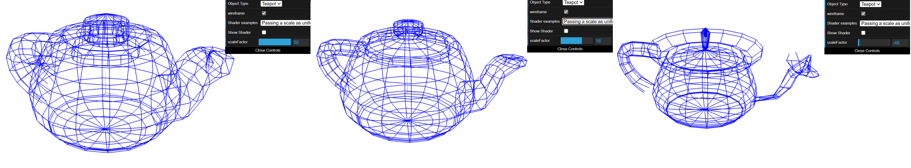
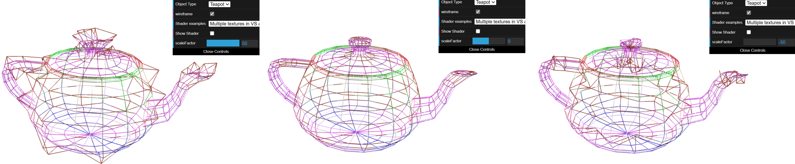
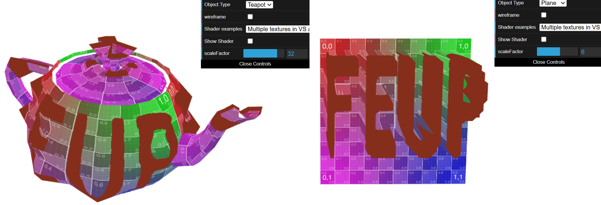

# CG 2024/2025

## Group T08G01
## TP 5 Notes

### **Experiments**
For this TP, we will focus on types of `shaders` and study the code corresponding to `vertex` and `fragment` shaders.

To start off, we will use the Teapot for the given tasks:

#### **Exp 1**
With the Teapot in Wireframe view, if we use `Passing a scale as Uniform` mode and change the `scaleFactor` on the interface, we will see the vertex position change:

This happens because in `ShaderScene()` when the `scaleFactor` is updated, activates the `onScaleFactorChanged()`, also called in `onSelectedShaderChanged()` when an selected shader changes.

#### **Exp 2**
Changing the mode for `Multiple textures in VS and FS`, when the `scaleFactor` is moved, not all vertex is now moved:

This can be analyzed better loking to the object Plane and without the checkbox of Wireframe, which only the vertexes related to "FEUP" letters move when `scaleFactor` changes, affecting in the same way to the Teapot:

#### **Exp 3**

#### **Exp 4**

#### **Exp 5**

#### **Exp 6**

### **Ex 1**

### **Ex 2**

